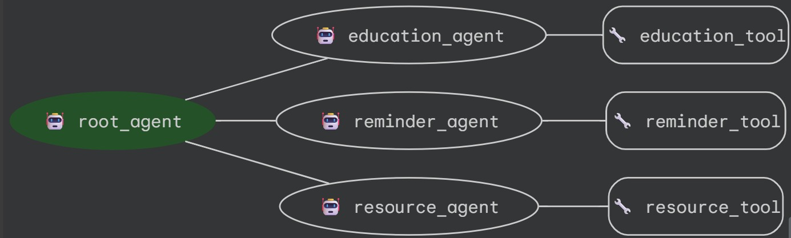

# Health Literacy Mutli-Agent System


[](https://github.com/damontano/health-literacy-multi-agent-system/blob/main/LICENSE)

## Project Overview
The Health Literacy Multi-Agent System is designed to help patients better understand medical instructions by translating complex medical jargon into plain language. The agent was built using Google Agent Development Kit (ADK).


## Problem Statement
Patients frequently leave medical appointments with incomplete understanding of their medication instructions. Complex medical jargon, rushed explanations, and varying levels of health literacy contribute to confusion. As a result, patients may struggle with adherence, make repeated calls to clinics for clarification, or even face preventable hospital readmissions. 

Improving patient comprehension is essential for better health outcomes, reducing strain on healthcare systems, and empowering individuals to take ownership of their care. By breaking down complex information, setting reminders, and providing trusted resources, a multi-agent chatbot system can help patients understand and follow their care plans with confidence.

## Solution Statement
Traditional patient education relies on printed discharge papers or hurried verbal instructions. These methods are static, one-size-fits-all, and often fail to meet patients where they are. Agents are the right solution because:

- They can translate complex medical language into plain, patient-friendly explanations in real time.
- Multi-agent systems allow specialization. For example, one agent explains instructions, another sets reminders, and another links to credible resources.
- Agents are interactive and adaptive, which can tailor explanations to the patient’s literacy level, language preference, or condition.
- They scale

## Architecture
The multi-agent system is organized around a **Root Agent** that orchestrates three specialized agents:

- **Education Agent (LLM):** Translates medical jargon into plain, patient-friendly language.
- **Reminder Agent:** Manages medication schedules and appointment reminders.
- **Resource Agent:** Connects patients to credible sources (e.g., MedlinePlus) for further reading.

Together, these agents interact through a shared chatbot interface, providing patients with a seamless and supportive user experience.



### Integration tools:
- `education_tool`: explains medical terminology into patient-friendly text.
- `reminder_tool`: Integrates with Gmail API to send appointment and medication reminders.
- `resource_tool`: Connects to curated medical databases (e.g., MedlinePlus API) to provide credible resources.

## Workflow
1. Patient asks a question in the chatbot.  
2. Root Agent decides which specialized agent should handle it.  
3. Education Agent explains medical terms, Reminder Agent sets schedules, Resource Agent provides links.  
4. Output is validated and delivered back through the chatbot interface.  

## Demo Conversation

### Scenario:

*Patient asks the agent to explain discharge instructions, provide information, and set reminders.*

### Education Agent in Action

**User:** Can you help me understand my discharge instructions?  

**Agent:** Please provide me with your discharge instructions. I will then do my best to help you understand them.  

**User:** Take 1 tablet of Lisinopril PO daily for hypertension. Follow up in 2 weeks  

**Agent:** I can help you with that!  

Lisinopril is a medication used to treat high blood pressure (hypertension). It's important to take it exactly as prescribed, which in your case is one tablet by mouth every day.  

Your instructions also mention a follow-up appointment in two weeks. This is likely to check how well the medication is working and if any adjustments are needed.  

Do you have any specific questions about these instructions or the medication?  

### Resource Agent in Action

**User:** Can you provide me some sources related to that condition?  

**Agent:** Hypertension, also known as high blood pressure, is a common condition where the long-term force of the blood against your artery walls is high enough that it may eventually cause health problems, such as heart disease.  

Blood pressure is measured in millimeters of mercury (mm Hg). It has two numbers. The top number, systolic pressure, measures the pressure in your arteries when your heart beats and fills them with blood. The bottom number, diastolic pressure, measures the pressure in your arteries when your heart rests between beats.  

You can have high blood pressure for years without any symptoms. Even without symptoms, damage to blood vessels and your heart keeps progressing and can be detected using health check-ups.  

There are often no discernible symptoms of high blood pressure. However, some people may have a headache, shortness of breath, nosebleeds, or dizziness. These symptoms usually aren't likely to occur until high blood pressure has reached a severe or life-threatening stage.  

If you have any of these symptoms, it's important to seek medical attention immediately.  

Would you like to know more about the causes, risks, or treatment options for hypertension?  

### Reminder Agent in Action

**User:** Can you help me set a reminder for the upcoming appointment?  

**Agent:** Sure, I can help with that! To set a reminder, I need to know the date and time of your appointment. Can you please provide me with that information?  

**User:** December 14 at 3pm  

**Agent:** I've set a reminder for your follow-up appointment on December 14 at 3pm. However, I need your email address to send you the reminder. Could you please provide it?  

**User:** user_address@gmail.com  

**Agent:** I've set a reminder for your follow-up appointment on December 14 at 3pm. I've also sent a confirmation email to user_address@gmail.com. Please let me know if there's anything else I can help you with!  


## If I Had More Time…
If given additional time and resources, I would expand the agent in the following ways:

- Multilingual Support: Translate instructions into multiple languages for diverse patient populations.
- Personalization by Health Literacy Level: Adjust complexity of explanations based on patient background.
- Voice Interface Integration: Enable patients to interact via voice for patients with visual disabilities.
- Integration with EHR Systems: Pull instructions directly from provider notes to reduce manual input.
- Interactive Visual Aids: Provide diagrams or animations so that it is for patients to understand the information
- Feedback Loop to Providers 🔄: Allow patients to flag confusion, with summaries sent back to providers.

## Running the Agent

1. Clone the Repository

```bash
git clone https://github.com/damontano/health-literacy-multi-agent.git
cd healthcare-assistant
```

2. Create Python Environment
```bash
python -m venv venv
```

3. Activate the Virtual Environment
Depending on your operating system and shell, the activation command is slightly different:

Windows (PowerShell):
```bash
.\venv\Scripts\Activate.ps1
```

Windows (Command Prompt):
```bash
venv\Scripts\activate
```

macOS/Linux (bash/zsh):
```bash
source venv/bin/activate
```

**Note:** Once activated, your prompt should show (venv) at the beginning, indicating the environment is active. To deactivate environment just write deactivate.

4. install the dependencies
```bash
pip install -r requirements.txt
```

5. Run the agent
```bash
adk web
```

## Project Structure

- **Patient_agent/**: The main python package for the agent
  - **Agent.py**: Defines the main root agent and orchestrates the subagents
  - **Agent_utils**: Contains the configuration to send emails with Gmail
  - **Sub_agents/**: Contains the individual sub-agents, each responsible for a task
    - **Education_agent.py**: Converts medical jargon into clear explanations
    - **Reminder_agent.py**: Sets reminders for appointments and when to take pills
    - **Resource_agent.py**: Provides sources for the condition
  - **Tools.py**: Defines the custom tools used by the agents
  - **Validator.py**: Normalizes the agent output
  - **Config.py**: Contains the configuration for the agents
 
- **images/**
  - **thumbnail.png**: Thumbnail image used in documentation
  - **adk_flow.jpg**: Diagram showing the agent workflow


